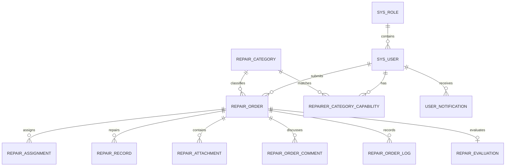

# 校园设施报修与资产管理系统数据库设计 - 第一阶段

> 一致性约定：第一阶段实现以 `need-step1-java-code.md` 为主；本文档只承载已确认的数据模型，不自行增加业务表或字段。

## 代码格式强制规范

- 禁止将多个 `import`、字段、语句、方法、HTML 标签或 CSS 规则压缩在同一行。
- 每行只表达一个清晰操作；复杂条件、链式调用和长参数必须合理换行。
- 禁止为了减少文件行数牺牲代码可读性。
- Java 重要业务逻辑必须使用中文注释说明业务原因、事务边界和并发约束。
- Java 数据库实体类及字段必须使用中文 Javadoc 说明。
- Vue 文件只保留 `<template>` 与外部资源声明，禁止内嵌 JavaScript 和 CSS。
- 每个 Vue 文件必须使用同目录同名 `.js` 文件承载脚本；存在私有样式时，使用同目录同名 `.scss` 文件承载样式。
- Vue 通过 `<script setup src="./同名文件.js"></script>` 和 `<style scoped src="./同名文件.scss"></style>` 引入脚本与私有样式。
- 由于 Vue 编译器原生禁止 `<script setup>` 使用 `src`，项目必须保留 Vite 前置转换插件，在 Vue 编译前读取并注入同名脚本；禁止移除该插件后继续使用外部脚本声明。
- 没有私有样式时不创建空 `.scss` 文件；全局共享样式继续放在 `src/assets/styles`。
- 后端调用链必须严格遵守 `Controller -> Service -> Mapper`，禁止跨层调用。
- Controller 只能声明接口注解、接收参数、调用 Service 和包装 `ApiResponse`，禁止直接依赖 Mapper、写业务逻辑、写数据库逻辑、创建业务实体、处理事务或写审计逻辑。
- Spring 管理的 Controller、Service、Component、Configuration、Filter 等类，依赖注入统一使用字段 `@Autowired`。
- Entity 到 VO 的转换必须统一放在 `converter` 包中，使用可直接维护的手写静态转换方法，禁止依赖 MapStruct 等编译期自动生成转换实现。
- ServiceImpl 必须直接调用 converter 静态方法，禁止将 converter 注册为 Spring Bean 或通过 `@Autowired` 注入。
- ServiceImpl 禁止编写业务载荷、Redis 载荷、DTO 或 VO 内部类；此类数据结构必须抽取为独立 Java 文件并补充中文 Javadoc。
- ServiceImpl 中所有事务方法必须显式使用 `@Transactional(rollbackFor = Exception.class)`。
- 重要类、重要方法和关键业务分支必须补充中文注释，说明业务原因、权限边界、事务边界和并发约束。

## 1. 核心约定

- 数据库使用 MySQL 8，字符集使用 `utf8mb4`。
- 主键统一使用 `BIGINT AUTO_INCREMENT`，由 MySQL 从 `1` 开始分配。
- 严禁使用雪花 ID、MyBatis-Plus `assign_id` 或应用层手动生成数据库主键。
- 第一阶段不建立数据库外键，由业务代码维护关联关系。
- 固定业务状态使用 `TINYINT` 存储，并由 Java 枚举维护含义。
- 工单使用 `version` 字段实现乐观锁。
- 系统不进行物理删除。

所有表必须包含以下字段：

| 字段 | 类型 | 说明 |
|---|---|---|
| `create_time` | `DATETIME` | 创建时间 |
| `update_time` | `DATETIME` | 最后更新时间 |
| `delete_state` | `TINYINT` | 0 正常，1 已删除 |

## 2. 表结构总览

| 表名 | 用途 |
|---|---|
| `sys_user` | 用户账号与认证信息 |
| `sys_role` | 用户角色 |
| `sys_dict_type` | 动态字典类型 |
| `sys_dict_data` | 动态字典数据 |
| `sys_login_log` | 登录安全日志 |
| `sys_operation_log` | 关键操作日志 |
| `repair_category` | 故障类型 |
| `repairer_category_capability` | 维修师傅故障类型能力关系 |
| `repair_order` | 报修工单 |
| `repair_assignment` | 接单与退回历史 |
| `repair_record` | 维修结果 |
| `repair_attachment` | OSS 图片附件 |
| `repair_order_comment` | 工单评论 |
| `repair_order_log` | 工单流转日志 |
| `repair_evaluation` | 维修评价与追评 |
| `user_notification` | 站内通知 |



## 3. 系统表

### 3.1 `sys_user`

| 字段 | 类型 | 说明 |
|---|---|---|
| `user_id` | `BIGINT` | 主键 |
| `user_no` | `VARCHAR(30)` | 学号或工号 |
| `real_name` | `VARCHAR(50)` | 真实姓名 |
| `nick_name` | `VARCHAR(50)` | 昵称 |
| `role_id` | `BIGINT` | 角色 ID |
| `email` | `VARCHAR(100)` | 已验证恢复邮箱，可为空 |
| `phone_number` | `VARCHAR(20)` | 学校预留或已验证主手机号 |
| `parent_phone` | `VARCHAR(20)` | 家长联系电话，仅作备注 |
| `avatar` | `VARCHAR(500)` | 头像 OSS 地址或对象 Key |
| `password` | `VARCHAR(100)` | BCrypt 密码摘要 |
| `activation_status` | `TINYINT` | 0 未激活，1 已激活 |
| `account_status` | `TINYINT` | 0 正常，1 停用，2 封禁 |
| `security_stamp` | `VARCHAR(64)` | 密码、联系方式、角色或账号状态变更时重新生成 |
| `phone_confirm_required` | `TINYINT` | 是否提醒确认主手机号 |
| `create_time` | `DATETIME` | 创建时间 |
| `update_time` | `DATETIME` | 更新时间 |
| `delete_state` | `TINYINT` | 逻辑删除状态 |

第一阶段每个用户仅拥有一个角色。普通管理员只能创建和维护学生、教师、维修师傅账号。

第一阶段不增加手机号验证状态字段。学生和教师的学校预留手机号在账号激活时完成验证，是否允许使用该手机号登录由 `activation_status` 和 `account_status` 共同判断；维修师傅和管理员手机号由管理员维护。

### 3.2 `sys_role`

| 字段 | 类型 | 说明 |
|---|---|---|
| `role_id` | `BIGINT` | 主键 |
| `role_name` | `VARCHAR(50)` | 固定角色编码 |
| `status` | `TINYINT` | 0 启用，1 停用 |
| `remark` | `VARCHAR(255)` | 角色说明，可为空 |
| `create_time` | `DATETIME` | 创建时间 |
| `update_time` | `DATETIME` | 更新时间 |
| `delete_state` | `TINYINT` | 逻辑删除状态 |

第一阶段固定角色为学生、教师、维修师傅和管理员。

第一阶段不增加独立角色编码字段，`role_name` 直接保存固定编码：

```text
STUDENT
TEACHER
REPAIRER
ADMIN
```

### 3.3 `sys_dict_type`

| 字段 | 类型 | 说明 |
|---|---|---|
| `dict_type_id` | `BIGINT` | 主键 |
| `dict_name` | `VARCHAR(100)` | 字典名称 |
| `dict_type` | `VARCHAR(100)` | 字典类型编码 |
| `status` | `TINYINT` | 0 启用，1 停用 |
| `remark` | `VARCHAR(255)` | 备注，可为空 |
| `create_time` | `DATETIME` | 创建时间 |
| `update_time` | `DATETIME` | 更新时间 |
| `delete_state` | `TINYINT` | 逻辑删除状态 |

第一阶段使用以下字典类型：

```text
repair_return_reason
repair_reject_reason
repair_close_reason
```

### 3.4 `sys_dict_data`

| 字段 | 类型 | 说明 |
|---|---|---|
| `dict_data_id` | `BIGINT` | 主键 |
| `dict_type` | `VARCHAR(100)` | 字典类型编码 |
| `dict_label` | `VARCHAR(100)` | 展示文本 |
| `dict_value` | `VARCHAR(100)` | 字典值 |
| `sort_order` | `INT` | 展示顺序 |
| `status` | `TINYINT` | 0 启用，1 停用 |
| `remark` | `VARCHAR(255)` | 备注，可为空 |
| `create_time` | `DATETIME` | 创建时间 |
| `update_time` | `DATETIME` | 更新时间 |
| `delete_state` | `TINYINT` | 逻辑删除状态 |

业务记录只保存最终原因文本，不保存字典数据 ID。

### 3.5 `sys_login_log`

| 字段 | 类型 | 说明 |
|---|---|---|
| `login_log_id` | `BIGINT` | 主键 |
| `user_id` | `BIGINT` | 用户 ID，可为空 |
| `login_identifier` | `VARCHAR(50)` | 学号、工号或脱敏手机号 |
| `login_type` | `VARCHAR(20)` | 登录方式 |
| `status` | `TINYINT` | 0 成功，1 失败 |
| `message` | `VARCHAR(255)` | 结果说明 |
| `login_ip` | `VARCHAR(128)` | 登录 IP |
| `create_time` | `DATETIME` | 创建时间 |
| `update_time` | `DATETIME` | 更新时间 |
| `delete_state` | `TINYINT` | 逻辑删除状态 |

### 3.6 `sys_operation_log`

| 字段 | 类型 | 说明 |
|---|---|---|
| `operation_log_id` | `BIGINT` | 主键 |
| `operator_id` | `BIGINT` | 操作人 ID |
| `operation_type` | `VARCHAR(50)` | 操作类型 |
| `target_type` | `VARCHAR(50)` | 操作目标类型 |
| `target_id` | `BIGINT` | 操作目标 ID，可为空 |
| `description` | `VARCHAR(500)` | 操作说明 |
| `operation_ip` | `VARCHAR(128)` | 操作 IP |
| `create_time` | `DATETIME` | 创建时间 |
| `update_time` | `DATETIME` | 更新时间 |
| `delete_state` | `TINYINT` | 逻辑删除状态 |

## 4. 业务表

### 4.1 `repair_category`

| 字段 | 类型 | 说明 |
|---|---|---|
| `category_id` | `BIGINT` | 主键 |
| `category_name` | `VARCHAR(50)` | 故障类型名称 |
| `description` | `VARCHAR(255)` | 类型说明，可为空 |
| `status` | `TINYINT` | 0 启用，1 停用 |
| `create_time` | `DATETIME` | 创建时间 |
| `update_time` | `DATETIME` | 更新时间 |
| `delete_state` | `TINYINT` | 逻辑删除状态 |

### 4.2 `repairer_category_capability`

| 字段 | 类型 | 说明 |
|---|---|---|
| `capability_id` | `BIGINT` | 主键 |
| `repairer_id` | `BIGINT` | 维修师傅用户 ID |
| `category_id` | `BIGINT` | 可处理的故障类型 ID |
| `create_time` | `DATETIME` | 创建时间 |
| `update_time` | `DATETIME` | 更新时间 |
| `delete_state` | `TINYINT` | 逻辑删除状态 |

第一阶段系统根据账号状态和该能力关系匹配可接单维修师傅，不使用 AI 推荐，不保存候选推荐结果。

### 4.3 `repair_order`

| 字段 | 类型 | 说明 |
|---|---|---|
| `order_id` | `BIGINT` | 主键 |
| `order_no` | `VARCHAR(32)` | 对外展示的工单编号 |
| `request_id` | `VARCHAR(64)` | 提交幂等标识 |
| `reporter_id` | `BIGINT` | 报修人 ID |
| `reporter_role_id` | `BIGINT` | 报修时角色 ID 快照 |
| `reporter_nickname` | `VARCHAR(50)` | 报修时昵称快照 |
| `reporter_avatar` | `VARCHAR(500)` | 报修时头像快照 |
| `title` | `VARCHAR(100)` | 报修标题 |
| `description` | `TEXT` | 故障描述 |
| `category_id` | `BIGINT` | 故障类型 ID |
| `campus` | `VARCHAR(100)` | 校区 |
| `building` | `VARCHAR(100)` | 楼栋，可为空 |
| `floor` | `VARCHAR(50)` | 楼层，可为空 |
| `location_detail` | `VARCHAR(500)` | 手动填写的位置补充说明 |
| `contact_phone` | `VARCHAR(20)` | 本次工单联系电话 |
| `status` | `TINYINT` | 工单状态 |
| `current_repairer_id` | `BIGINT` | 当前维修师傅 ID，可为空 |
| `unresolved_count` | `INT` | 反馈未解决次数 |
| `version` | `INT` | 乐观锁版本 |
| `create_time` | `DATETIME` | 创建时间 |
| `update_time` | `DATETIME` | 更新时间 |
| `delete_state` | `TINYINT` | 逻辑删除状态 |

工单状态时间和状态变化原因统一从 `repair_order_log` 查询。

工单状态由 Java 枚举维护：

```text
DRAFT
PENDING_DISPATCH
PENDING_ACCEPT
ACCEPTED
PROCESSING
PENDING_CONFIRM
PENDING_ARBITRATION
COMPLETED
REJECTED
CLOSED
```

### 4.4 `repair_assignment`

| 字段 | 类型 | 说明 |
|---|---|---|
| `assignment_id` | `BIGINT` | 主键 |
| `order_id` | `BIGINT` | 工单 ID |
| `repairer_id` | `BIGINT` | 接单维修师傅 ID |
| `status` | `TINYINT` | 接单状态 |
| `return_reason` | `VARCHAR(500)` | 退回原因，可为空 |
| `create_time` | `DATETIME` | 接单时间 |
| `update_time` | `DATETIME` | 最后更新时间 |
| `delete_state` | `TINYINT` | 逻辑删除状态 |

接单状态由 Java 枚举维护：

```text
ACCEPTED
RETURNED
COMPLETED
CLOSED
```

### 4.5 `repair_record`

| 字段 | 类型 | 说明 |
|---|---|---|
| `record_id` | `BIGINT` | 主键 |
| `order_id` | `BIGINT` | 工单 ID |
| `repairer_id` | `BIGINT` | 维修师傅 ID |
| `result_description` | `VARCHAR(1000)` | 维修结果说明，可为空 |
| `attempt_no` | `INT` | 第几次维修结果 |
| `create_time` | `DATETIME` | 创建时间 |
| `update_time` | `DATETIME` | 更新时间 |
| `delete_state` | `TINYINT` | 逻辑删除状态 |

### 4.6 `repair_attachment`

| 字段 | 类型 | 说明 |
|---|---|---|
| `attachment_id` | `BIGINT` | 主键 |
| `order_id` | `BIGINT` | 工单 ID |
| `record_id` | `BIGINT` | 维修结果 ID，可为空 |
| `object_key` | `VARCHAR(500)` | OSS 对象 Key |
| `uploader_id` | `BIGINT` | 上传人 ID |
| `create_time` | `DATETIME` | 创建时间 |
| `update_time` | `DATETIME` | 更新时间 |
| `delete_state` | `TINYINT` | 逻辑删除状态 |

`record_id` 为空表示报修现场图片，不为空表示维修结果图片。

第一阶段不增加附件类型或绑定状态字段，附件创建时直接关联已有工单，并使用 `record_id` 区分图片用途。

### 4.7 `repair_order_comment`

| 字段 | 类型 | 说明 |
|---|---|---|
| `comment_id` | `BIGINT` | 主键 |
| `order_id` | `BIGINT` | 工单 ID |
| `author_id` | `BIGINT` | 评论人 ID，系统评论可为空 |
| `comment_type` | `TINYINT` | 0 用户评论，1 系统评论 |
| `content` | `VARCHAR(1000)` | 评论正文 |
| `is_pinned` | `TINYINT` | 是否置顶 |
| `is_withdrawn` | `TINYINT` | 是否已撤回 |
| `withdraw_time` | `DATETIME` | 撤回时间，可为空 |
| `create_time` | `DATETIME` | 创建时间 |
| `update_time` | `DATETIME` | 更新时间 |
| `delete_state` | `TINYINT` | 逻辑删除状态 |

### 4.8 `repair_order_log`

| 字段 | 类型 | 说明 |
|---|---|---|
| `log_id` | `BIGINT` | 主键 |
| `order_id` | `BIGINT` | 工单 ID |
| `operator_id` | `BIGINT` | 操作人 ID，系统操作可为空 |
| `action` | `TINYINT` | 操作类型 |
| `from_status` | `TINYINT` | 原状态，可为空 |
| `to_status` | `TINYINT` | 新状态，可为空 |
| `remark` | `VARCHAR(1000)` | 操作说明或原因，可为空 |
| `create_time` | `DATETIME` | 创建时间 |
| `update_time` | `DATETIME` | 更新时间 |
| `delete_state` | `TINYINT` | 逻辑删除状态 |

### 4.9 `repair_evaluation`

| 字段 | 类型 | 说明 |
|---|---|---|
| `evaluation_id` | `BIGINT` | 主键 |
| `order_id` | `BIGINT` | 工单 ID |
| `repairer_id` | `BIGINT` | 被评价维修师傅 ID |
| `star` | `TINYINT` | 1～5 星 |
| `content` | `VARCHAR(1000)` | 首次评价内容，可为空 |
| `follow_up_content` | `VARCHAR(1000)` | 追评内容，可为空 |
| `follow_up_time` | `DATETIME` | 追评时间，可为空 |
| `create_time` | `DATETIME` | 创建时间 |
| `update_time` | `DATETIME` | 更新时间 |
| `delete_state` | `TINYINT` | 逻辑删除状态 |

一个工单最多创建一条评价记录。

### 4.10 `user_notification`

| 字段 | 类型 | 说明 |
|---|---|---|
| `notification_id` | `BIGINT` | 主键 |
| `receiver_id` | `BIGINT` | 接收人 ID |
| `order_id` | `BIGINT` | 关联工单 ID，可为空 |
| `notification_type` | `TINYINT` | 通知类型 |
| `title` | `VARCHAR(100)` | 通知标题 |
| `content` | `VARCHAR(1000)` | 通知内容 |
| `is_read` | `TINYINT` | 0 未读，1 已读 |
| `read_time` | `DATETIME` | 阅读时间，可为空 |
| `create_time` | `DATETIME` | 创建时间 |
| `update_time` | `DATETIME` | 更新时间 |
| `delete_state` | `TINYINT` | 逻辑删除状态 |

## 5. 索引与唯一约束

### 5.1 唯一约束

| 表名 | 字段 |
|---|---|
| `sys_user` | `user_no` |
| `sys_user` | `phone_number` |
| `sys_user` | `email` |
| `sys_role` | `role_name` |
| `sys_dict_type` | `dict_type` |
| `sys_dict_data` | `dict_type, dict_value` |
| `repair_category` | `category_name` |
| `repairer_category_capability` | `repairer_id, category_id` |
| `repair_order` | `order_no` |
| `repair_order` | `request_id` |
| `repair_record` | `order_id, attempt_no` |
| `repair_attachment` | `object_key` |
| `repair_evaluation` | `order_id` |

MySQL 唯一索引允许多个 `NULL`，因此可选邮箱不影响未绑定邮箱的账号。

### 5.2 普通索引

| 表名 | 索引字段 | 用途 |
|---|---|---|
| `sys_user` | `role_id` | 按角色查询用户 |
| `sys_login_log` | `user_id, create_time` | 查询用户登录日志 |
| `sys_operation_log` | `operator_id, create_time` | 查询操作日志 |
| `repairer_category_capability` | `category_id, repairer_id` | 按故障类型匹配维修师傅 |
| `repair_order` | `reporter_id, create_time` | 查询用户报修记录 |
| `repair_order` | `current_repairer_id, status` | 查询维修师傅工单 |
| `repair_order` | `status, create_time` | 管理员按状态查询工单 |
| `repair_order` | `category_id` | 按故障类型筛选 |
| `repair_order` | `campus, building` | 按校区和楼栋筛选 |
| `repair_assignment` | `order_id, create_time` | 查询接单历史 |
| `repair_assignment` | `repairer_id, create_time` | 查询维修师傅接单历史 |
| `repair_record` | `order_id` | 查询维修结果 |
| `repair_attachment` | `order_id` | 查询工单图片 |
| `repair_order_comment` | `order_id, create_time` | 查询工单评论 |
| `repair_order_log` | `order_id, create_time` | 查询工单流转日志 |
| `user_notification` | `receiver_id, is_read, create_time` | 查询用户通知 |

### 5.3 核心业务约束

- 接单时使用 `repair_order.status + version` 条件更新，保证同一工单只能被一名维修师傅成功接取。
- 用户角色、工单状态、接单状态、评分范围和未解决次数上限由后端业务代码校验。
- 字典数据和故障类型被历史数据引用后优先停用，不进行物理删除。
- 第一阶段不使用 AI 推荐和管理员手动派单；匹配不到维修师傅时，工单保持待匹配状态。
- 维修能力关系或维修师傅账号可用状态变化时，业务代码重新检查受影响的待匹配和待接单工单。

## 6. 默认初始化数据

数据库迁移必须创建 16 张业务表。Flyway 额外维护 `flyway_schema_history`，该表不是业务表。

### 6.1 Flyway 种子数据

`V2__seed_base_data.sql` 初始化以下基础数据：

固定角色：

| 角色 ID | 角色编码 | 说明 | 状态 |
|---|---|---|---|
| `1` | `STUDENT` | 学生 | 启用 |
| `2` | `TEACHER` | 教师 | 启用 |
| `3` | `REPAIRER` | 维修师傅 | 启用 |
| `4` | `ADMIN` | 管理员 | 启用 |

原因字典：

| 字典类型 | 字典名称 | 字典值 |
|---|---|---|
| `repair_return_reason` | 维修退回原因 | `CAPABILITY_MISMATCH` 能力不匹配、`OTHER` 其他 |
| `repair_reject_reason` | 报修驳回原因 | `INVALID` 无效报修、`OTHER` 其他 |
| `repair_close_reason` | 工单关闭原因 | `DUPLICATE` 重复且无需处理、`OTHER` 其他 |

故障类型：

| 类型 ID | 类型名称 | 说明 | 状态 |
|---|---|---|---|
| `1` | 水电维修 | 照明、供水与供电故障 | 启用 |
| `2` | 门窗维修 | 门锁、门窗及玻璃故障 | 启用 |
| `3` | 网络故障 | 校园网络与信息点故障 | 启用 |

### 6.2 开发环境启动初始化数据

`DevelopmentDataInitializer` 在应用启动时补齐开发演示账号和维修能力关系。
所有演示账号统一密码为 `Campus123!`，均已激活且账号状态正常。

| 角色 | 账号 | 姓名/昵称 | 手机号 |
|---|---|---|---|
| 管理员 | `admin` | 系统管理员 | `13800000001` |
| 学生 | `student` | 演示学生 | `13800000002` |
| 教师 | `teacher` | 演示教师 | `13800000003` |
| 维修师傅 | `repairer` | 演示维修师傅 | `13800000004` |

默认维修能力：演示维修师傅 `repairer` 具备 `1` 水电维修、`2` 门窗维修、`3` 网络故障。

默认不预置工单、接单记录、维修记录、附件、评论、评价、站内通知、登录日志和操作日志。
## 后端分层、Spring 注入与 DTO/VO 强制规范

- 后端调用链必须严格遵守 `Controller -> Service -> Mapper`，禁止跨层调用。
- `service` 包只允许放业务接口；同名实现类必须放在 `service.impl` 包中，并使用 `XxxServiceImpl implements XxxService`。
- Controller 禁止直接依赖 Mapper，禁止写业务逻辑、数据库逻辑、事务逻辑、审计逻辑和实体组装逻辑。
- Controller 仅允许声明接口注解、接收 DTO 参数、调用 Service、返回 `ApiResponse`。
- Spring Bean 依赖统一使用字段 `@Autowired` 注入。
- 所有请求体必须使用 DTO，禁止使用 `Map<String, Object>` 或 `Map<String, String>` 直接接收业务请求。
- 所有接口响应必须使用 VO 或 `PageResult<VO>`，禁止直接返回数据库 Entity。
- DTO 只表达请求参数，VO 只表达前端需要的响应字段；敏感字段如密码摘要、`securityStamp` 禁止出现在 VO。
- 重要类、重要方法和关键业务分支必须补充中文注释，说明业务原因、权限边界、事务边界和并发约束。
