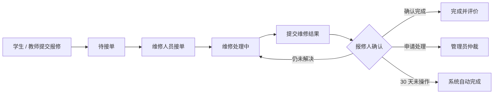
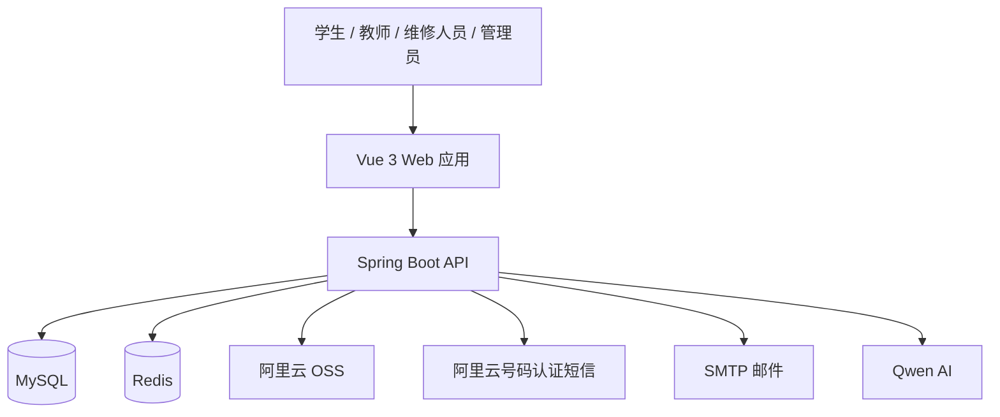

# 知维

## 项目图片


## 项目介绍

知维是一套面向校园场景的设施报修与资产管理系统。

系统连接学生、教师、维修人员和管理员，覆盖报修提交、工单处理、结果确认、服务评价、资产管理与运营统计等完整流程。通过清晰的角色权限、可追溯的工单日志、自动提醒与智能辅助，让校园维修工作更高效、更透明。

## 项目亮点

- **完整报修闭环**：提交报修、接单、维修、确认、评价全流程在线完成。
- **严格角色权限**：学生、教师、维修人员、管理员拥有独立的页面、接口和数据权限。
- **工单状态可追溯**：状态流转、系统评论、维修记录和操作日志完整留痕。
- **资产联动管理**：支持资产台账、批量导入、资产报修和维修状态自动联动。
- **实时消息提醒**：站内信结合 SSE 推送，及时通知工单进展。
- **智能辅助能力**：支持疑似重复报修检测、派单分析、语义搜索和自然语言统计查询。
- **自动化任务**：支持长周期提醒、待确认自动完成、超期草稿与冗余附件清理。
- **真实外部服务**：支持阿里云 OSS、号码认证短信、SMTP 邮件与 DashScope AI。

## 系统角色

| 角色 | 主要能力 |
|---|---|
| 学生 | 提交报修、查看进度、参与沟通、确认结果、评价维修服务 |
| 教师 | 提交报修、查看进度、参与沟通、确认结果、评价维修服务 |
| 维修人员 | 查看待接工单、接单、开始维修、提交结果、维护接单状态 |
| 管理员 | 工单派单与处理、用户管理、资产管理、基础数据维护、统计分析 |

系统仅包含以上四类角色。管理员负责系统管理，但不会自动继承其他角色的业务操作权限。

## 功能模块

### 报修工单

- 按故障分类、校园、楼栋、楼层和房间提交报修。
- 支持普通报修与关联资产报修。
- 支持故障图片、维修结果图片和工单评论。
- 支持撤回、接单、退回、驳回、关闭、仲裁和未解决反馈。
- 支持确认完成、自动完成、评价与追评。
- 保存位置、资产和报修人信息快照，保证历史记录准确。

### 维修工作台

- 按维修能力匹配可接工单。
- 支持并发接单保护，避免同一工单被重复领取。
- 支持暂停接单、恢复接单和暂停原因记录。
- 提供个人工作概览与维修建议提交能力。

### 资产管理

- 维护资产分类、资产台账和资产图片。
- 支持 Excel 与图片识别导入。
- 支持资产状态手动调整与工单状态自动联动。
- 同一资产存在未结束工单时，禁止重复创建关联工单。
- 资产状态变化全程记录日志。

### 管理中心

- 工单查询、人工派单、状态处理与 Excel 导出。
- 用户、位置、故障分类、维修能力和接单状态管理。
- 维修建议处理、人工账号恢复、登录日志和操作日志。
- 管理看板、趋势分析、分类统计与维修人员工作统计。

### 智能辅助

- 疑似重复报修检测与判定说明。
- 管理员派单分析与历史工单语义搜索。
- 资产、建议和工单的自然语言查询。
- 自然语言统计查询与导出预览。

## 工单流程



系统会在维修周期第 3 天和第 7 天进行提醒；维修结果提交后，会在待确认第 3、7、27 天提醒报修人，并在第 30 天自动完成仍未确认的工单。

## 系统架构



| 模块 | 技术栈 |
|---|---|
| 后端 | Java 17、Spring Boot 3、Spring Security、MyBatis-Plus、Flyway |
| 前端 | Vue 3、Vite 6、Element Plus、Pinia、ECharts |
| 数据服务 | MySQL 8.4、Redis 7.4 |
| 外部服务 | 阿里云 OSS、号码认证短信、SMTP 邮件、Qwen AI |

## 项目结构

```text
Campus-System/
  Campus-Backen/          # Spring Boot 后端
  front/                  # Vue 3 前端
  docker-compose.yml      # 本地 MySQL 与 Redis
  .env.example            # 环境变量配置示例
  README.md               # 项目说明
```

## 快速开始

### 环境要求

- JDK 17
- Node.js 18+
- Docker Desktop
- PowerShell

### 1. 启动数据服务

在项目根目录执行：

```powershell
$OutputEncoding = [Console]::OutputEncoding = [Text.UTF8Encoding]::new()
docker compose up -d
docker compose ps
```

默认服务地址：

| 服务 | 地址 |
|---|---|
| MySQL | `localhost:3307` |
| Redis | `localhost:6379` |

需要重置本地数据时执行：

```powershell
docker compose down -v
docker compose up -d
```

该命令会删除本地 MySQL 与 Redis 数据卷，请仅在确认不需要保留数据时使用。

### 2. 启动后端

```powershell
cd Campus-Backen
.\mvnw.cmd spring-boot:run
```

后端默认地址：`http://localhost:8080`

首次启动时，Flyway 会自动创建并迁移数据库。非生产环境会初始化开发账号、维修能力和基础位置数据。

### 3. 启动前端

新开一个 PowerShell 窗口：

```powershell
cd front
npm install
npm run dev
```

前端默认地址：`http://localhost:5173`

## 开发账号

开发环境统一密码：`husa123456`

| 角色 | 账号 |
|---|---|
| 管理员 | `admin` |
| 学生 | `student` |
| 教师 | `teacher` |
| 维修人员 | `repairer` |

开发账号仅用于本地调试。生产环境必须启用 `prod` Profile，避免初始化演示账号。

## 环境配置

项目通过环境变量连接数据库、Redis 和外部服务。根目录 `.env.example` 提供了完整配置示例。

| 类别 | 主要环境变量 |
|---|---|
| 数据库 | `CAMPUS_DB_URL`、`CAMPUS_DB_USERNAME`、`CAMPUS_DB_PASSWORD` |
| Redis | `REDIS_HOST`、`REDIS_PORT`、`REDIS_PASSWORD` |
| 安全 | `JWT_SECRET`、`EXPOSE_VERIFICATION_CODE` |
| 短信 | `ALIYUN_ACCESS_KEY_ID`、`ALIYUN_ACCESS_KEY_SECRET`、`ALIYUN_SMS_SIGN_NAME`、`ALIYUN_SMS_TEMPLATE_CODE` |
| OSS | `ALIYUN_OSS_ENDPOINT`、`OSS_BUCKET_NAME` |
| 邮件 | `SMTP_HOST`、`SMTP_PORT`、`MAIL_USERNAME`、`MAIL_PASSWORD`、`SMTP_FROM` |
| AI | `DASHSCOPE_API_KEY`、`AI_ENABLED` |

开发环境可以开启验证码回显。需要调用真实短信或邮件服务时，应设置：

```text
EXPOSE_VERIFICATION_CODE=false
```

短信使用阿里云号码认证服务，模板变量需要包含 `code` 和 `min`。

## 构建与测试

后端测试：

```powershell
cd Campus-Backen
.\mvnw.cmd clean test
```

前端生产构建：

```powershell
cd front
npm ci
npm run build:prod
```

当前版本已完成核心接口、角色权限、浏览器流程、数据库完整性、真实短信、邮件、OSS 与长周期任务验收。

## 部署提示

- 生产环境必须使用高强度 `JWT_SECRET`。
- 生产环境必须关闭验证码回显。
- 生产环境必须使用 `prod` Profile。
- 数据库、Redis、OSS、短信、邮件和 AI 凭据应通过运行环境注入。
- 部署前应再次执行后端测试与前端生产构建。
